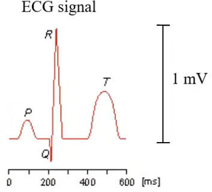

# Biosignals of Humans
## Sense of Vision
* Light is enery packed in photons
* observed color: reflected light of object
* black --> perfect absorber
* white --> total reflection
* light entering and slight bending through cornea
* passing small opening, i.e. pupil
* travelling through lens, strong bending 
* striking photoreceptors in the retina (photoreceptors are secondary cells)
### Retina
* Light enters:
	1. optic nerve
	2. Ganglion cells 
	3. Bipolar cells 
	4. Connecting nerve cells 
	5. Cone Rods
	6. Cells containing melanin
* Rods highly sensitive to light, but do not detect color, connected to optical nerve with 100:1
* Cones: three types, lower light sensitivity, connected to optical nerve with 1:1
### Photoreceptors
* Light sensitivity
* Secondary sensing cells
* Dark: Depolarization because of Na+ inflow through transmitter-gated channel (cGMP), synaptic transmission
* Light: cGMP concentration reduces, synaptic transmission stops
* Thus only graded changes in the membrane potential, no action potentials
* Spatial resolution:
	* Convergence by adding up outputs of Rods
	* Lateral inhibition to increase contrast
### On and Off Sensing cells 
* On-sensing cells (sensing cells + bipolar cell):
	* Light --> Hyperpolarization --> Depolarization of bipolar cell, with **symaptic inverter** (depolarization of presynaptic membrane leads to hyperpolarization of postsynaptic membrane)
* Off-sensing units:
	* Light --> Hyperpolarization --> Hyperpolarization with synaptic non-inverter
	* are used for contrast detection (lateral inhibition for spatial resolution)
### Osmoreceptor
* Osmosis: two different concentrations of substance
	* Diffusion: higher concentration diffuses to lower concentration in order to equalize concentrations
	* Osmosis: permeable membrane between concentration, only permeable to one type of molecule --> molecules diffuse in direction of higher concentrated solution
* Red blood cells:
	* Hypertonic (concentrated solution outside): water leaves red blood cells, they shrink
	* Hypotonic (diluted solution outside, e.g. due to sweating): water enters red blood cells, the get swollen and can even burst
		* to prevent this, osmoreceptors exist
* Osmoreceptors:
	* mechanically gated channel
	* Hypotonic solution outside: Water comes into cell, tension on the membrane increases, this tension opens mechanically gated channels --> salt can leave cell --> salt concentration inside cell goes down --> water inflow goes down
	* does, osmotic pressure is balanced
# Electrical Biosignals
## Passive
### Electrocardiography (ECG)
#### Generation of electrical Biosignals
* local excitation, equalizing current
* quasi-continuos propagation
* differentiation of action potentials along space
* in other words, only spatial change is visible --> no observable difference if cell is not excited or fully excited (potential difference in both cases = 0)
##### Depolarization of heart
* Registering of electrical excitation of heart muscles
* Potential difference on the body surface
* 2 heart muscles, connected at Artriaventricular node
* Excitation results in induced current
* This then gives a electromagnetic field, which is measured with three electrodres placed on the skin
* Potential drop between Electrode A and B, as well as B and C is measured
* Potential drop should be about the same
* If drop is greater between two electrodes than between the other two, inner bleedings could have occured
	* inner bleading results in conducting body
	* this bends the electromagnetic field such that the density of field lines between two electrodes is lower
	* this results in a signal of lesser magnitude
* **ECG:** Projection of total dipole on electrode axis
	
	* P wave: excitation of atria
	* Q, R waves: excitation of ventricals
	* T wave: repolarisation
	* in the heart, the repolarization goes from the outside to the inside, thus, the current flows in the same direction as for the depolarization
	* because of this, the t wave points in the same direction as the P, Q and R waves
* Electrical axis of heart:
	* mean direction of the total dipoleduring QRS complex
	* determined by net area of QRS complex:
		* area > 0 --> heart vector in same direction as lead vector
		* area = 0 --> heart vector perpendicular to lead vector
		* area < 0 --> heart vector opposite to lead vector
	* repolarization of atria is in QRS complex 
#### Application issues of ECG
* Hardware principle:
	* two input channels, high passes to get rid of DC influence, buffers
	* both channels are then connected to a difference amplifier and furthermore a lowpass
	* they are also connected to a sum amplifier, that is inverted and applied to third electrode 
* Clinical use for:
	* Propagation of excitation and its back formation
	* Heart position and heart rate
* Not used for:
	* Pumping activity
	* Mechanical contraction of heart 
* Can be analysed with Power Spectral density, Principal Component Analysis, Independent component Analysis
	* spliiting along frequency, variance or independence
